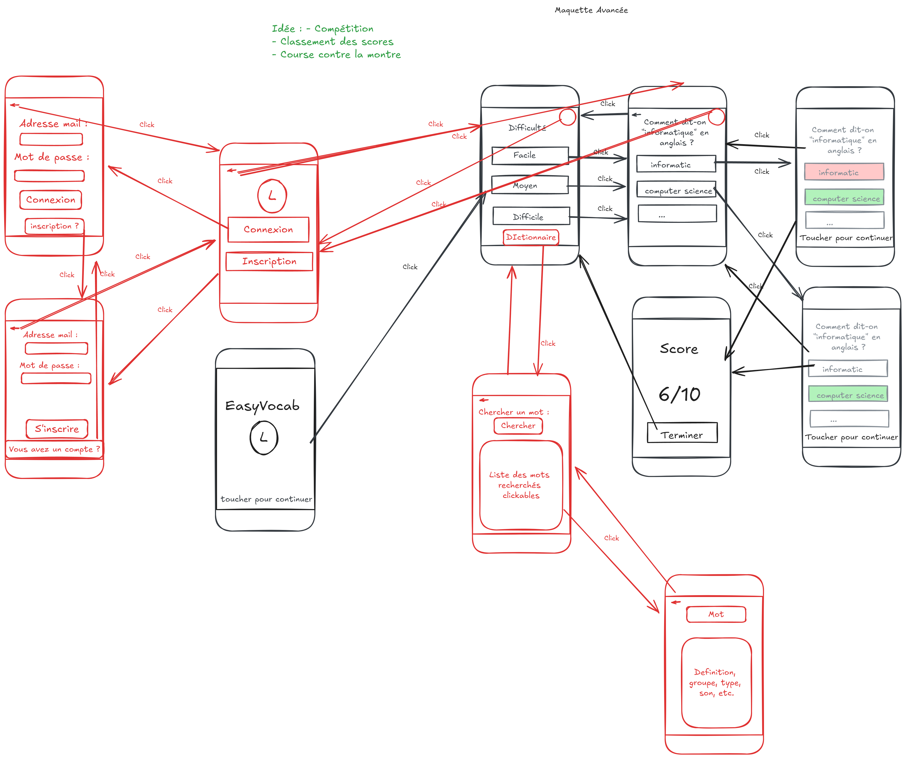

# INFO507_EasyVocab

## Description

EasyVocab est une application de quiz de vocabulaire accompagnée d'un dictionnaire en anglais. Actuellement, l'application est en développement dans le cadre d'un travail pratique (TP) et s'approche d'un projet complet. Le but est de s'entraîner à utiliser le langage Kotlin pour la première fois.

## Sujet du TP

Objectif : Concevoir et développer une application mobile de bout en bout.

Vous êtes libres du thème de l'application (social, divertissement, pratique...).
Votre projet doit être original et inclure TOUS les points suivants :

    Une liste navigable ;
    Une connexion à un service externe ;
    Un stockage des données en local ;
    Un accès à (au moins) une fonctionnalité du smartphone.

Vous pouvez travailler seul ou par deux (recommandé).

## Fonctionnalités

Description :

- Quiz de vocabulaire pour tester vos connaissances en anglais.
- Accès à un dictionnaire pour consulter des mots et leurs significations.

IDE :

- Android Studio (https://developer.android.com/studio?hl=fr)
- Visual Studio Code (https://code.visualstudio.com/)

## Collaboration

Ce projet est réalisé par deux étudiants en L3 Informatique :

- Mathieu LIN
- Benjamin CLIN

### Maquette avant la construction du projet

## Maquette minimale

## Maquette avancee (prévision)

### Maquette après la construction

## Maquette finale

## Liens

- [GitHub Repository](https://github.com/Mathieu-Lin/INFO507_EasyVocab)

## Source

Utilisation de l'API sans tokens : https://dictionaryapi.dev/

La création du service externe se limitera à une simple fichier statique placé sur le serveur et disponible à l'adresse suivante, http://51.68.91.213/<login>/<fichier>
http://51.68.91.213/gr-1-1/vocabEN.json

Cours de l'application mobile : David WAYNTAL et Francois BOUSSION
Université Savoie Mont Blanc 2024-2025 (USMB)
